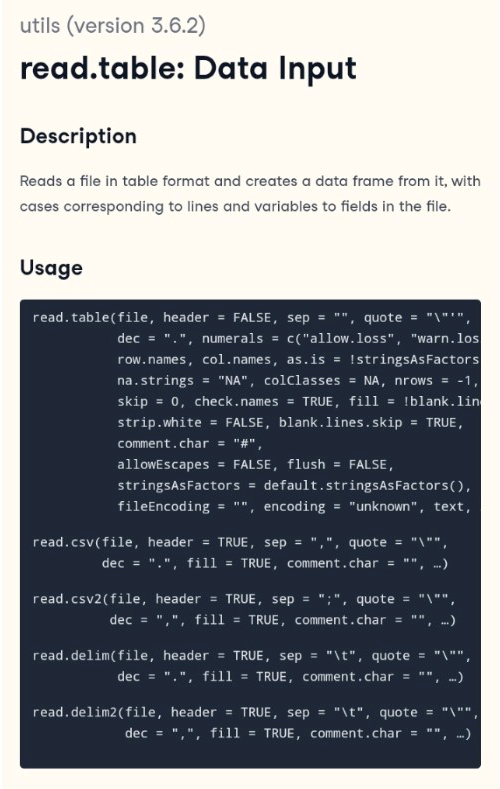
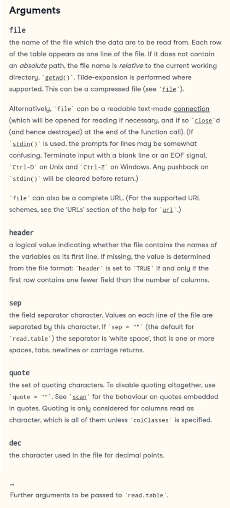
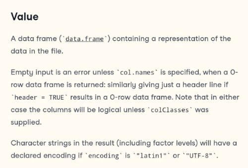
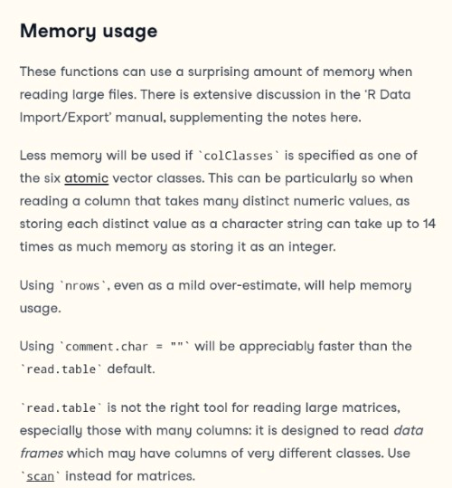
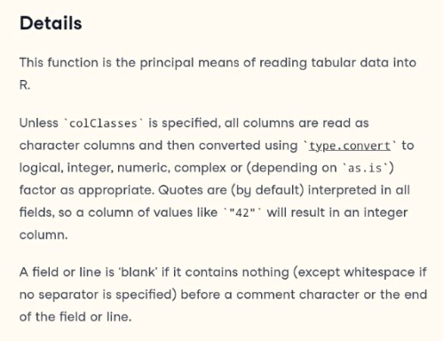
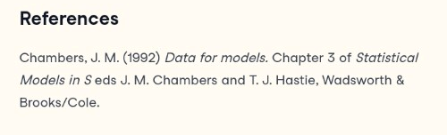
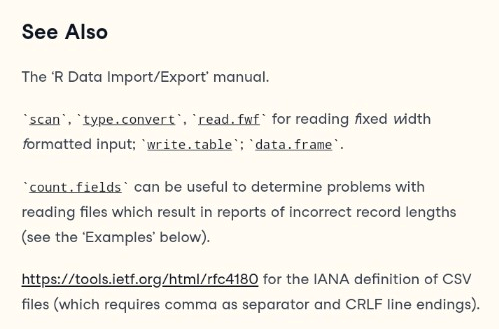
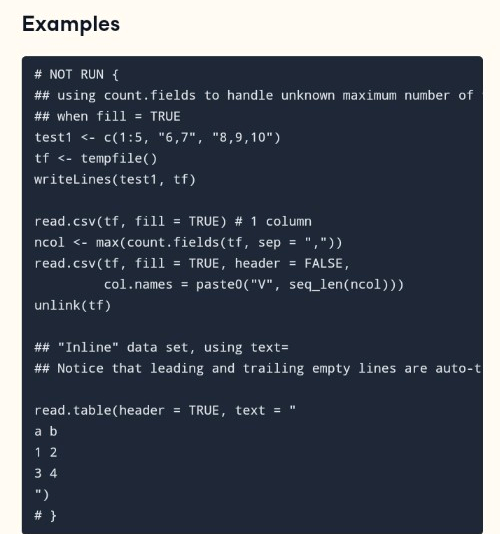

*What to do if you get lost in R?*

<!--more-->

Now that you know how to access the R-intern help pages you need to know how to read them. Typically, the R Help files follow a fairly standard outline as seen below in a heavily clipped screenshot of the function `read.table`. Different functions might have different sections, but these are the main ones you should be aware of:

<u>Package Name:</u>  The package to which the function belongs to (in grey).   
<u>Title:</u>  The name of the function and its purpose.
  
<u>Description:</u>  An extended description of what the function does.
  
<u>Usage</u>:  A description of the syntax of the function. This is where all the arguments can be found that can be supplied to the function, as well as any default values of these arguments.
  

---

<u>Arguments:</u>  A description of each argument.    Usually this includes a specification of the class (character, numeric, list, etc.).    This section is an important one to understand, because arguments are frequently a cause of errors in R.
                   

---

<u>Value:</u>  A description of the class of the value returned by the function.
       

---

<u>Other comments:</u>  Other comments worth mentioning.
            

---

<u>Details:</u>  Extended details about how the function works, provides longer descriptions of the various ways to call the function and a longer discussion of the arguments.
      

---

<u>References:</u>  References on which scientific basis the functions and arguments are based.
  

---

<u>See also:</u>  Links to other relevant functions that can be read.
      

---

<u>Examples:</u>  Worked examples of real R code that can be pasted into the R console and run.
           

---

## Summary

* **Title:** name of the function.
* **Description:** a short description of what the function does.
* **Usage:** the syntax of the function.
* **Arguments:** the description of the arguments taken by the function.
* **Value:** the value returned by the function
* **Examples:** provide examples on how to use the function

<!--
## Further reading

???
Syntax Erklärung in die help Seite einbauen
  - sowas mit function(object, argument=parameter) und wie man das in der Hilfe findet
  - funktionsname z.b. read.csv, paket, argumente, parameter, reihenfolge, defaults wenn nicht explizit genannt.

              

  
  

  
  <u>Value:</u> A description of the class of the value returned by the function.

add some day
-->
