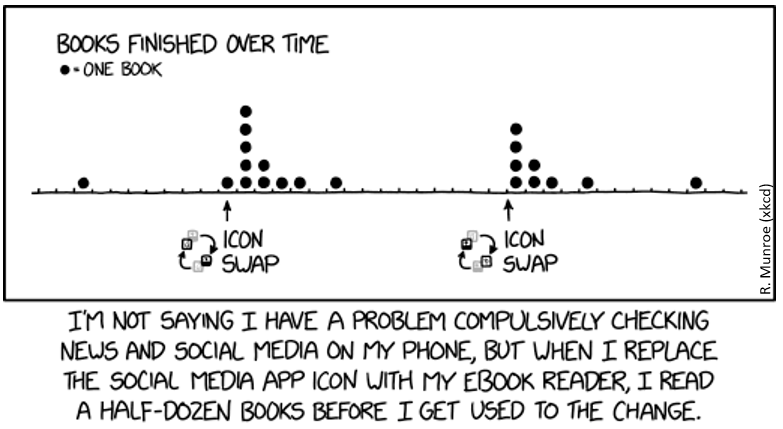

## What is a Dotplot?
<style>.unit p {text-align: justify;}</style>
<div class="unit">

<p><b>Short Version:</b> A dot plot is just a bar chart that uses dots to represent individual quanta. <br> <br>
<b>Long Version:</b> A Dot Plot, also called a dot chart or strip plot, is a type of simple histogram-like chart used in statistics for relatively small data sets where values fall into a number of discrete bins (categories). A dot plot is similar to a bar graph because the height of each “bar” of dots is equal to the number of items in a particular category. To draw one, count the number of data points falling in each bin (What is a BIN in statistics?) and draw a stack of dots that number high for each bin.
</p></div>

Create dotplots with the `dotchart(x, labels=)` function, where x is a numeric vector and labels is a vector of labels for each point. You can add a `groups=` option to designate a factor specifying how the elements of x are grouped. If so, the option `gcolor=` controls the color of the groups label. cex controls the size of the labels.

## Example with mtcars:
__Not grouped and colored at all, sorted by mpg:__

```
data(mtcars) #loading mtcars
dotchart(mtcars$mpg,labels=row.names(mtcars),cex=.7,
         main="Gas Milage for Car Models",
         xlab="Miles Per Gallon")

```




### Dotplot by gears
__Grouped, Sorted and Colored, sort by mpg, group and color by gears:__

```
x <- mtcars[order(mtcars$mpg),] # sort by mpg
x$gear <- factor(x$gear) # it must be a factor
x$color_gear[x$gear==3] <- "red"
x$color_gear[x$gear==4] <- "blue"
x$color_gear[x$gear==5] <- "darkgreen"
dotchart(x$mpg,labels=row.names(x),cex=.7,groups= x$gear,
         main="Gas Milage for Car Models\ngrouped by gear",
         xlab="Miles Per Gallon", gcolor="black", color=x$color)
``````

### Dotplot by cylinder
__Grouped, Sorted and Colored, sort by mpg, group and color by cylinders:__

```
x <- mtcars[order(mtcars$mpg),] # sort by mpg
x$cyl <- factor(x$cyl) # must be a factor
x$color_cyl[x$cyl==4] <- "red" # setting red for 4 cylinder
x$color_cyl[x$cyl==6] <- "blue" #setting blue for 6 cylinder
x$color_cyl[x$cyl==8] <- "darkgreen" # setting green for 8 cylinder
dotchart(x$mpg,labels=row.names(x),cex=.7,groups= x$cyl,
         main="Gas Milage for Car Models\ngrouped by cylinder",
         xlab="Miles Per Gallon", gcolor="black", color=x$color)
```



### Difference between Dotplot and Scatterplot:
* A dot plot is just a bar chart that uses dots to represent **individual** quanta. So if you wanted to plot the number of pets per household, you might have 10 households with 0 pets, 20 with 1 pet, 12 with 2 pets, etc. Over zero, you'd draw 10 dots; over one, you'd draw 20 dots, etc. In the example below shows which car type can drive how much miles per gallon.

* Scatterplots are used to determine the **strength of a relationship** between two numerical variables. The X-axis represents the independent variable and the Y-axis the dependent variable. For example, if you measure a cars horsepower and miles per gallon, you could create a scatter plot where one axis represented horsepower and one represented miles per gallon. Each point on a scatter plot represents one car.


