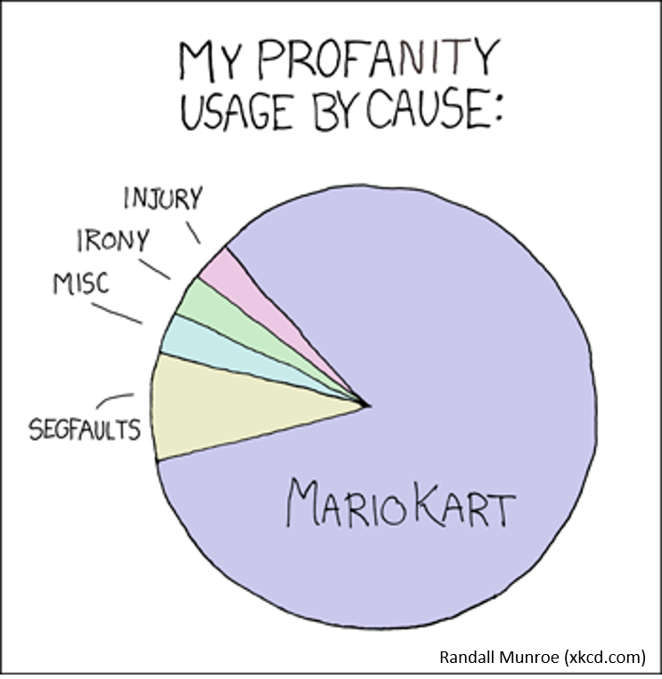

<!--more-->
## What is a Pie Chart?
<style>.unit p {text-align: justify;}</style>
<div class="unit">

<p>A pie chart is a form of representation (e.g. percentage distributions) for partial values of a whole as parts of a circle. The pie chart is circular and divided into several pie sectors, whereby each pie sector represents a partial value and the pie thus represents the sum of the partial values (the whole). <br>
<br>
Pie charts are often used for representation of distributions and proportions. The number of partial values should not exceed 7, otherwise the diagram becomes confusing. Several small partial values are also displayed confusingly. In this case, it is recommended to combine the small partial values into an "Other" value. Usually, the clarity increases if the partial values are sorted clockwise by size and the largest partial value starts on the 12 o'clock line, as in a clock.</p></div>

The basic syntax for creating a pie-chart using the R is:

`pie(x, labels, radius, main, col, clockwise)`

Following is the description of the parameters used:
* x is a vector containing the numeric values used in the pie chart.
* labels is used to give description to the slices.
* radius indicates the radius of the circle of the pie chart.(value between −1 and +1).
* main indicates the title of the chart.
* col indicates the color palette.
* clockwise is a logical value indicating if the slices are drawn clockwise or anti clockwise.

## Example with cars and data(iris):
<div class="unit"><p>Pie charts are not recommended in the R documentation, and their features are somewhat limited. The authors recommend bar or dot plots over pie charts because people are able to judge length more accurately than volume. Pie charts are created with the function pie(x, labels=) where x is a non-negative numeric vector indicating the area of each slice and labels= notes a character vector of names for the slices.</p></div>

```
# Create data for the graph.
x <- c(21, 62, 10, 53)
labels <- c("Tesla", "VW", "Opel", "BMW")

# Plot the chart with title, label and rainbow color pallete.
pie(x, labels, main = "Cars", col = rainbow(length(x)))
```
```
# Pie Chart with Percentages
# Calculate percentages
piepercent<- round(100*x/sum(x), 1)

# Plot the chart with labels, percentages and legend.
pie(x, labels = piepercent, main = "Cars in %",col = heat.colors(length(x)))
legend("topright", c("Tesla","VW","Opel","BMW"), cex = 0.8,
       fill = heat.colors(length(x)))
```
```
# Pie Chart with percentages behind labels

labels <- paste(labels, piepercent) # add percents to labels
labels <- paste(labels,"%",sep="") # add % symbol to labels
pie(x,labels = labels, col=cm.colors(length(labels)),
    main="Pie Chart of Cars")
```
```
# Pie Chart from data frame (iris) with appended sample sizes
iris_table <- table(iris$Species)
labels <- paste(names(iris_table), "\n", iris_table, sep="")
pie(iris_table, labels = labels,
    main="Pie Chart of Species\n with sample size")
```


<html>
<head>
<meta name="viewport" content="width=device-width, initial-scale=1">
<style>
div {
  margin-bottom: 15px;
  padding: 4px 12px;
}

.info {
  background-color: #e7f3fe;
  border-left: 6px solid #2196F3;
}

</style>
</head>
<body>
<div class="info">
  <p><strong>Info: R base color palettes</strong>  <br>
  There are 5 R base functions that can be used to generate a vector of n contiguous colors:   <br>
  <code class="language-plaintext highlighter-rouge">rainbow(n)</code>
  <code class="language-plaintext highlighter-rouge">heat.colors(n)</code>
  <code class="language-plaintext highlighter-rouge">terrain.colors(n)</code>
  <code class="language-plaintext highlighter-rouge">topo.colors(n)</code>
  <code class="language-plaintext highlighter-rouge">cm.colors(n)</code>
  </p>
</div>
</body>
</html>

