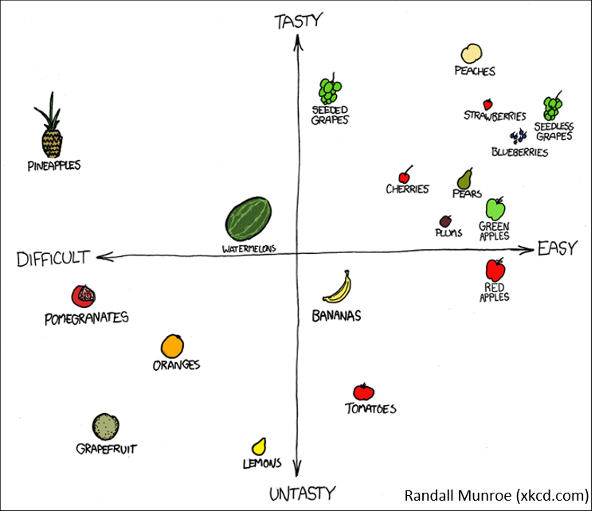

## What is a Scatterplot?
<style>.unit p {text-align: justify;}</style>
<div class="unit">
<p>A scatter plot is a graphical representation of observed pairs of values of two statistical characteristics. These pairs of values are plotted in a Cartesian coordinate system, resulting in a scatter plot. The points can be represented by different symbols. It is hoped that the pattern of points in the scatter plot will provide information about the dependency structure of the two features represented by the coordinates.</p></div>

There are many ways to create a scatterplot in R. The basic function is `plot(x, y)`, where x and y are numeric vectors denoting the (x,y) points to plot.

## Example with mtcars:
```
plot(mtcars$wt, mtcars$mpg, main="Scatterplot Example",
     xlab="Car Weight ", ylab="Miles Per Gallon ", pch=19)
```
```
# adding Regression lines and a legend
abline(lm(mtcars$mpg~mtcars$wt), col="steelblue") # regression line (y~x)
lines(lowess(mtcars$wt,mtcars$mpg), lty=2, col="darkgreen") # LOWESS/LOESS line (x,y)
legend("topright", legend=c("Regression", "LOWESS"),
       col=c("steelblue", "darkgreen"), lty=1:2, cex=0.8)
```


<html>
<head>
<meta name="viewport" content="width=device-width, initial-scale=1">
<style>
div {
  margin-bottom: 15px;
  padding: 4px 12px;
}

.info {
  background-color: #e7f3fe;
  border-left: 6px solid #2196F3;
}

</style>
</head>
<body>
<div class="info">
  <p><strong>Info</strong>  <br>
  LOWESS (Locally Weighted Scatterplot Smoothing), sometimes called LOESS (locally weighted smoothing), is a popular tool used in regression analysis that creates a smooth line through a timeplot or scatter plot to help you to see relationship between variables and foresee trends.
  </p>
</div>
</body>
</html>


## Test your knowledge!
<iframe src="https://geomoer.github.io/moer-h5p-content/h5p-standalone-1.3.x/demo/base-r-unit09-scatterplot.html" width="1090" height="600" frameborder="0" allowfullscreen="allowfullscreen" allow="geolocation *; microphone *; camera *; midi *; encrypted-media *"> </iframe><script src="https://h5p.org/sites/all/modules/h5p/library/js/h5p-resizer.js" charset="UTF-8"></script> 